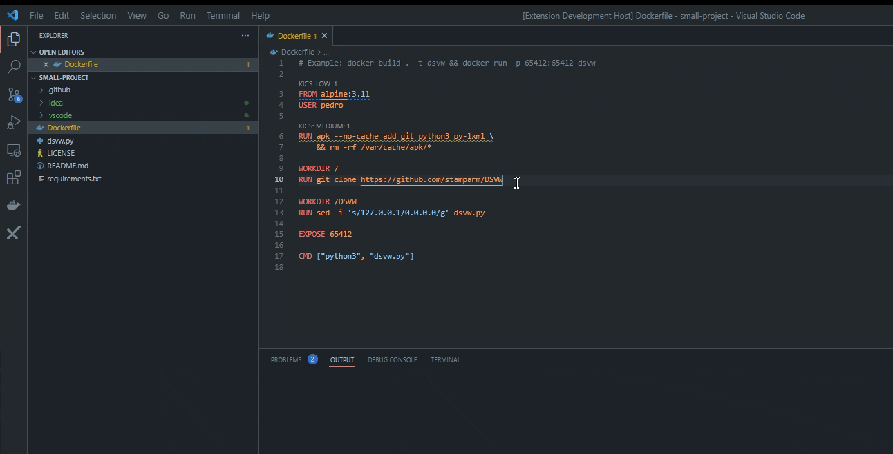
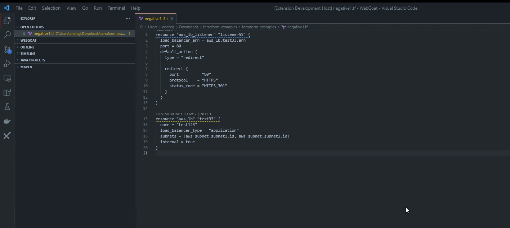

 

[![Contributors][contributors-shield]][contributors-url]
[![Forks][forks-shield]][forks-url]
[![Stargazers][stars-shield]][stars-url]
[![Issues][issues-shield]][issues-url]
[![License][license-shield]][license-url]
[![Installs][installs-vscode-shield]][installs-vscode-url]

 

   

  <h3 align="center">AST-VSCODE-PLUGIN</h3>

  

    <a href="https://checkmarx.com/resource/documents/en/34965-68742-checkmarx-one-visual-studio-code-extension--plugin-.html"><strong>Explore the docs »</strong></a>
     
    <a href="https://marketplace.visualstudio.com/items?itemName=checkmarx.ast-results"><strong>Marketplace »</strong></a>
  

  
Table of Contents

  <ol>
    <li>
      <a href="#about-the-project">About The Project</a>
    </li>
    <li>
      <a href="#getting-started">Getting Started</a>
      <ul>
        <li><a href="#prerequisites">Prerequisites</a></li>
        <li><a href="#installation">Setting Up</a></li>
      </ul>
    </li>
    <li><a href="#usage">Usage</a></li>
    <li><a href="#contributing">Contributing</a></li>
    <li><a href="#license">License</a></li>
    <li><a href="#contact">Contact</a></li>
  </ol>

## About The Project

The CxAST Visual Studio Code plugin (extension) enables you to import results from a CxAST scan directly into your VS Code console. You can view the vulnerabilities that were identified in your source code and navigate directly to the vulnerable code in the editor. 

### Main Features
- Import CxAST scan results
- Show results from all scan types (CxSAST, CxSCA, and KICS)
- Group results by file, language, severity, and status
- Navigate from results directly to the vulnerable code in the editor
- Vulnerable code is highlighted in the editor

<!-- GETTING STARTED -->
## Getting Started

All our documentation on how to get started with our extension can be found [here](https://checkmarx.com/resource/documents/en/34965-68742-checkmarx-one-visual-studio-code-extension--plugin-.html).

<!-- PREREQUISITES -->
## Prerequisites

- You have a Checkmarx One account and can run Checkmarx One scans on your source code.
- You have an API key for your Checkmarx One account.
- You must have Docker installed and running in your environment (For KICS auto scanning only)

## Usage

# Kics Auto Scan

# Quick Fix

## Contributing

We appreciate feedback and contribution to the VsCode extension! Before you get started, please see the following:

- [Checkmarx contribution guidelines](docs/contributing.md)
- [Checkmarx Code of Conduct](docs/code_of_conduct.md)

<!-- LICENSE -->
## License

Distributed under the [Apache 2.0](LICENSE). See `LICENSE` for more information.

<!-- CONTACT -->
## Contact

Checkmarx - AST Integrations Team

Project Link: [https://github.com/Checkmarx/ast-vscode-extension](https://github.com/Checkmarx/ast-vscode-extension)

Find more integrations from our team [here](https://github.com/Checkmarx/ci-cd-integrations#checkmarx-ast-integrations)

© 2022 Checkmarx Ltd. All Rights Reserved.

[contributors-shield]: https://img.shields.io/github/contributors/Checkmarx/ast-vscode-extension.svg
[contributors-url]: https://github.com/Checkmarx/ast-vscode-extension/graphs/contributors
[forks-shield]: https://img.shields.io/github/forks/Checkmarx/ast-vscode-extension.svg
[forks-url]: https://github.com/Checkmarx/ast-vscode-extension/network/members
[stars-shield]: https://img.shields.io/github/stars/Checkmarx/ast-vscode-extension.svg
[stars-url]: https://github.com/Checkmarx/ast-vscode-extension/stargazers
[issues-shield]: https://img.shields.io/github/issues/Checkmarx/ast-vscode-extension.svg
[issues-url]: https://github.com/Checkmarx/ast-vscode-extension/issues
[license-shield]: https://img.shields.io/github/license/Checkmarx/ast-vscode-extension.svg
[license-url]: https://github.com/Checkmarx/ast-vscode-extension/blob/master/LICENSE
[installs-vscode-url]: https://marketplace.visualstudio.com/items?itemName=checkmarx.ast-results
[installs-vscode-shield]: https://img.shields.io/visual-studio-marketplace/i/checkmarx.ast-results
