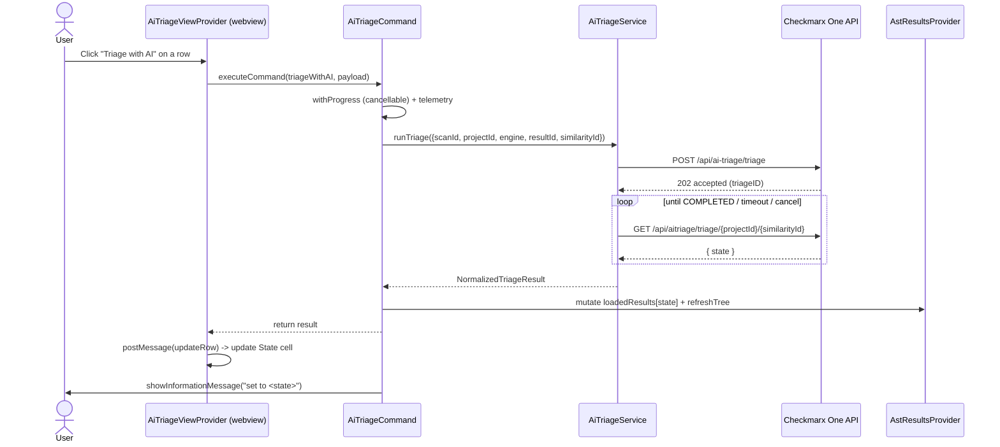
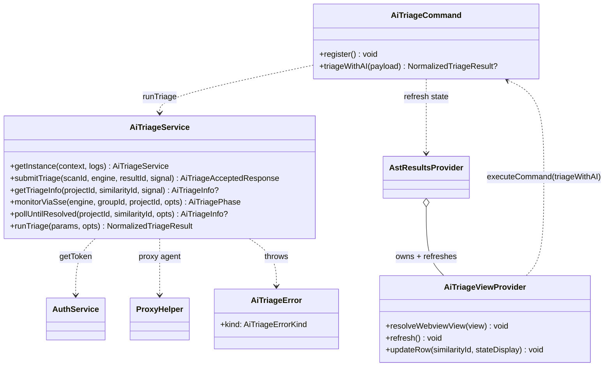

# AI Triage (Checkmarx One)

This document describes the **AI Triage** feature added to the Checkmarx One VS Code
extension: an in-IDE surface for the platform's AI-generated triage decisions,
exposed as a Risk-Orchestration-style table with a **Triage with AI** action per
finding.

---

## 1. Architecture analysis (existing extension)

| Concern | Where it lives | Notes |
| --- | --- | --- |
| Platform SAST/SCA results | `AstResult` (`models/results.ts`), loaded from the scan JSON via `readResultsFromFile` | Carries `type`, `similarityId`, `severity`, `status`, `state`, `getResultHash()` |
| Result identifiers for triage | `AstResult.getResultHash()` (SAST → `data.resultHash`, SCA → `id`) + `similarityId`; `projectId`/`scanId` in `workspaceState` (`constants.projectIdKey` / `scanIdKey`) | The four IDs the AI Triage API needs are split across the result and workspace state |
| Existing (manual) triage | `utils/triage.ts` → `cx.triageUpdate` (CLI wrapper → `sast-results-predicates`) | Surfaced in the results tree + details webview |
| Authentication | `AuthService.getToken()` (SecretStorage), base URL derived from JWT `iss` | Reused as-is |
| HTTP + proxy | `axios` + `ProxyHelper.createHttpsProxyAgent()` | Same pattern as `authService.checkUrlExists` |
| Diagnostics / Problems | Realtime scanners publish `Diagnostic`s with `CxDiagnosticData` | Realtime findings have **no** platform IDs |
| Webview table (Risk Orchestration) | `views/riskManagementView` (bootstrap/codicons) | Reference implementation for our table |
| Command registration | prefixed via `commandBuilder.ts`; contributed in `package.json` | |
| Progress / notifications | `vscode.window.withProgress` + `showInformationMessage/showErrorMessage` | No custom wrapper |
| Telemetry | `cx.setUserEventDataForLogs(...)` | Same call used by the "Fix with AI" flow |

### Key constraint (why Checkmarx One, not realtime Problems)

The platform AI Triage API operates on **SAST/SCA platform scan results** and
requires `scanID` + `resultID` + `projectId` + `similarityId`. The Developer
Assist realtime findings in the Problems window are local CLI results and carry
**none** of these identifiers, so they cannot be triaged by the API. AI Triage is
therefore implemented against the Checkmarx One results (which have all four IDs),
and surfaced as a columnar table — the same place the capability lives on the
platform ("Risk Orchestration").

---

## 2. Files

### New

| File | Responsibility |
| --- | --- |
| `models/aiTriage.ts` | Types (request/response/info/phase), engine detection, state ↔ tag/display mapping, `normalizeTriageInfo` |
| `services/aiTriageService.ts` | API client: `submitTriage`, `monitorViaSse`, `pollUntilResolved`, `getTriageInfo`, `runTriage`; reuses auth/proxy; typed `AiTriageError` |
| `commands/aiTriageCommand.ts` | `Triage with AI` command: progress, cancellation, telemetry, error handling, post-triage refresh |
| `views/aiTriageView/aiTriageViewProvider.ts` | Self-contained webview table + pure helpers (`mapResultsToRows`, `buildAiTriageHtml`) |
| `unit/aiTriage.test.ts`, `unit/aiTriageService.test.ts`, `unit/aiTriageCommand.test.ts` | Unit + integration tests |

### Modified

| File | Change |
| --- | --- |
| `utils/common/commandBuilder.ts` | `triageWithAI`, `refreshAiTriage`, `openAiTriageView` commands + `aiTriageView` view id |
| `utils/common/constants.ts` | `triageWithAI` telemetry subtype |
| `views/resultsView/astResultsProvider.ts` | Instantiate + register the AI Triage view; refresh it on scan/result changes (mirrors `riskManagementView`) |
| `activate/activateCxOne.ts` | Register `AiTriageCommand` wired to the results provider |
| `packages/checkmarx/package.json` | Contribute the `ast-results.aiTriage` view, the 3 commands, and a refresh button |

---

## 3. API flow

```
1. POST {base}/api/ai-triage/triage
   body: { scanID, buckets: [{ scannerType: "sast"|"sca", resultIDs: [resultHash] }] }
   -> 202 { status: "accepted", triageID, published, existingTriageState }

2. Monitor until COMPLETED:
   (preferred) GET {base}/api/ssegateway/triage-status?engine=&groupId=&projectId=  (SSE)
   (fallback)  GET {base}/api/aitriage/triage/{projectId}/{similarityId}  (poll)

3. Read decision:
   GET {base}/api/aitriage/triage/{projectId}/{similarityId}
   -> normalized to { stateDisplay, stateTag, severity?, comment? }
```

- **Auth:** `Authorization: Bearer <token>` (token from SecretStorage), `cx-origin` header.
- **Base URL:** derived from the token's `iss` claim (multi-tenant `iam.*` → `ast.*`).
- **Proxy:** `ProxyHelper.createHttpsProxyAgent()` as the axios agent.

> The docs specify SSE for monitoring but do not define how to derive `groupId`
> from a result. The service therefore treats SSE as best-effort (used only when a
> `groupId` is supplied) and **polls the Info API** as the deterministic default,
> falling back to polling if the SSE stream errors.

---

## 4. Sequence diagram



## 5. Class diagram



---

## 6. Design decisions

1. **Target Checkmarx One SAST/SCA results** — the only findings with the IDs the
   API requires (see the constraint above).
2. **Single service boundary** — all AI Triage I/O goes through `AiTriageService`,
   reusing existing auth/proxy/logging; the AI Triage endpoints are not in the CLI
   wrapper, so a direct authenticated axios call is used (like `authService`).
3. **Polling as the reliable monitor, SSE best-effort** — because `groupId` for the
   SSE stream is not derivable from a result in the documented contract.
4. **Self-contained webview** — table HTML is rendered in TypeScript (testable) with
   inline CSS/JS and a strict CSP + nonce; no external JS bundle to keep untested.
5. **Reuse the risk-view lifecycle** — the AI Triage view is owned and refreshed by
   `AstResultsProvider` exactly like `riskManagementView`, so it updates
   automatically when the project/scan/results change (no reload required).
6. **Typed errors** — `AiTriageError` maps auth/permission/network/timeout/api/
   malformed/cancelled to meaningful, non-crashing user messages.

## 7. Testing

- `aiTriage.test.ts` — state mapping, engine detection, `normalizeTriageInfo`,
  base-URL derivation, SSE phase parsing, request building, row mapping, HTML.
- `aiTriageService.test.ts` — `nock` HTTP: submit (202/401/403/no-token/network),
  info (200/404), polling (change + timeout), end-to-end `runTriage`.
- `aiTriageCommand.test.ts` — validation, success + tree state mutation, error
  handling, view message routing + row update/reset.

Run: `npm run unit:test:core` (or `cd packages/core && npx mocha`).

## 8. Future improvements

- **Bulk triage** — the API supports multiple `resultIDs`; add multi-select in the table.
- **AI Remediation** — the same API family exposes remediation + auto-PR; a "Remediate with AI" action is a natural follow-up.
- **True SSE monitoring** — once `groupId` derivation is documented, prefer SSE to reduce polling.
- **Credits/feature-flag awareness** — surface tenant credits and the `AI_TR_RO_*` feature-flag state before triggering, and gate the view accordingly.
- **Triage change log** — show history via `GET /api/sast-results-predicates/{similarityId}` in a row detail.
- **Details-panel integration** — add the AI-triage state + action to the existing result details webview.
